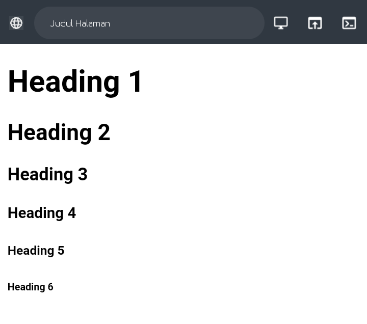

# HTML Basic


HTML memang bahasa yang wajib dipelajari, bagi yang mau menjadi web developer.

Karena… HTML merupakan bahasa dasar untuk membuat web.


## Apa itu html ?
- HTML adalah singkatan dari Hyper Text Markup Language
- HTML adalah bahasa markup standar untuk membuat halaman Web
- HTML menggambarkan struktur halaman Web
- HTML terdiri dari serangkaian elemen
- Elemen HTML memberi tahu browser content apa yang akan ditampilkan pada browser

## Cara kerja html
Yang harus di persiapkan untuk menuliskan kode html adalah :
1. Text editor ( di android kamu bisa menggunakan aplikasi Acode atau Trebedit )
2. Web browser ( setiap perangkat Android pasti sudah memiliki browser bawaan yang paling populer adalah Chrome )

### Text Editor
Text editor adalah aplikasi yang akan kamu gunakan untuk menulis kode html 

### Web browser ( Chrome )
Chrome akan kamu gunakan sebagai hasil dari kode yang kamu tuliskan.

## Menulis kode html
Untuk menulis kode html buka text editor kamu, disini saya gunakan Acode sebagai alat untuk coding saya.

### Buat berkas baru
Untuk menjalankan kode html kamu harus membuat berkas baru dengan extensi .html secara umum biasanya kita buat file dengan nama index.html

### Mulai menulis kode
```
<!DOCTYPE html>
<html>
<head>
<title>Code on Phone</title>
</head>
<body>
<h1>Konten header</h1>
<p>Ini adalah paragraft</p>
</body>
</html>
```


Jika kode di atas di jalankan maka browser akan menampilkan konten seperti ini


### Penjelasan


- `<!DOCTYPE html>` Arti kode ini adalah mendefinisikan bahwa dokumen ini adalah dokumen HTML5

- `<html>` adalah elemen root/utama dari halaman HTML

- `<head>` berisi informasi meta tentang halaman HTML

- `<title>` menentukan judul untuk halaman HTML (yang ditampilkan di bilah judul browser atau di tab halaman)

- `<body>` mendefinisikan tubuh dokumen, dan merupakan wadah untuk semua konten yang akan di tampilkan di browser, seperti judul, paragraf, gambar, hyperlink, tabel, daftar, dll.

- `<h1>` mendefinisikan heading besar

- `<p>` mendefinisikan paragraf


## Apa itu element ?

Elemen HTML didefinisikan oleh tag pembuka `<nama_tag>`, konten, dan tag penutup `</nama_tag>` :

ilustrasi :

`<tagname> Konten ada di sini... </tagname >`

Contoh :
```
<h1> Judul Pertama Saya </h1>

<p> Paragraf pertama saya. </p>
```
| Element |||
|----------|---------|---------|
| Tag Pembuka | Konten | Tag Penutup |
| `<h1>` | Ini heading | `</h1>` |
| `<p>` | Ini paragraft | `</p>` |

### Struktur Dasar HTML


## HTML Basic
Dalam bab ini saya akan menunjukkan beberapa contoh HTML dasar.

Jangan khawatir jika saya menggunakan tag yang belum kamu pelajari.

### Dokumen HTML
Semua dokumen HTML harus dimulai dengan deklarasi tipe dokumen: `<!DOCTYPE html>`.

Dokumen HTML itu sendiri dimulai dengan `<html>` dan diakhiri dengan `</html>`.

Bagian yang akan di tampilkan sebagai konten pada browser adalah antara `<body>` dan `</body>`.

### Latihan 
Coba tuliskan kode berikut pada dokumen HTML kamu

```
<!DOCTYPE html>
<html>
<head>
<title>Judul Halaman</title>
</head>
<body>
<h1>This is heading 1</h1>
<h2>This is heading 2</h2>
<h3>This is heading 3</h3>
</body>
</html>
```
Jika kamu jalankan kode nya maka akan tampil seperti ini :


## Atribut HTML

Atribut HTML memberikan informasi tambahan pada elemen HTML.

- Semua elemen HTML dapat memiliki atribut

- Atribut memberikan informasi tambahan tentang elemen

- Atribut selalu ditentukan di tag awal

- Atribut biasanya datang dalam pasangan nama/nilai seperti: nama="nilai"

### Atribut href
Tag `<a>` mendefinisikan hyperlink. Atribut href menentukan URL halaman yang dituju tautan :

Contoh :

```
<!DOCTYPE html>
<html>
<head>
<title>Judul Halaman</title>
</head>
<body>
<h1>This is heading 1</h1>
<h2>This is heading 2</h2>
<h3>This is heading 3</h3>
<a href="https://facebook.com">Facebook</a>
</body>
</html>
```
Jika kamu jalankan kode diatas maka akan tampil seperti ini :


Jika kamu klik tulisan **Facebook** berwarna biru maka kamu akan di alihkan ke halaman web Facebook

### Atribut src
Tag `` digunakan untuk menyematkan gambar di halaman HTML. Atribut `src` menentukan jalur ke gambar yang akan ditampilkan:

```
<!DOCTYPE html>
<html>
<head>
<title>Judul Halaman</title>
</head>
<body>
<h1>This is heading 1</h1>
<h2>This is heading 2</h2>
<h3>This is heading 3</h3>
<a href="https://facebook.com">Facebook</a>

</body>
</html>
```
Jika kamu jalankan kode html tersebut maka akan tampil seperti ini :


### Atribut lebar dan tinggi

Tag `` juga harus berisi atribut `width` dan `height`, yang menentukan lebar dan tinggi gambar.

Coba tambahkan atribut `width` dan `height` pada tag img atur ukuran semau kamu. gunakan dalam pixel

```
<!DOCTYPE html>
<html>
<head>
<title>Judul Halaman</title>
</head>
<body>
<h1>This is heading 1</h1>
<h2>This is heading 2</h2>
<h3>This is heading 3</h3>
<a href="https://facebook.com">Facebook</a>

</body>
</html>
```


Sekarang ukuran gambar sudah berubah

Ada banyak sekali atribut dalam HTML tidak akan habis satu hari untuk membahasnya kamu bisa jelajahi sendiri di situs **w3school** atribut dapat kamu temukan di sini [Referensi Lengkap Atribut HTML](https://www.w3schools.com/tags/ref_attributes.asp)

## Heading html
Heading HTML adalah judul atau subjudul yang ingin kamu tampilkan di halaman web.

Judul HTML didefinisikan dengan tag `<h1>` sampai `<h6>`

`<h1>` mendefinisikan judul yang paling besar. 

`<h6>` mendefinisikan heading yang paling kecil.


Contoh :

```
<!DOCTYPE html>
<html>
<head>
<title>Judul Halaman</title>
</head>
<body>
<h1>Heading 1</h1>
<h2>Heading 2</h2>
<h3>Heading 3</h3>
<h4>Heading 4</h4>
<h5>Heading 5</h5>
<h6>Heading 6</h6>
</body>
</html>
```

Maka akan tampil seperti ini :




## Paragraft

Paragraf selalu dimulai pada baris baru, dan biasanya berupa blok teks.

Elemen HTML `<p>` mendefinisikan sebuah paragraf.

Sebuah paragraf selalu dimulai pada baris baru, dan browser secara otomatis menambahkan beberapa spasi (margin) sebelum dan sesudah paragraf.

Contoh 1 :

```
<!DOCTYPE html>
<html>
<head>
<title>Judul Halaman</title>
</head>
<body>
<p>Ini adalah sebuah paragraf, paragraft di buat dengan tag p </p>
</body>
</html>
```


Contoh 2 :

```
<!DOCTYPE html>
<html>
<head>
<title>Judul Halaman</title>
</head>
<body>
<p>Ini adalah sebuah paragraf, paragraft di buat dengan tag p </p>
<p>Ini adalah paragraf ke 2, paragraft di buat dengan tag p </p>
</body>
</html>
```


Contoh 3 :

```
<!DOCTYPE html>
<html>
<head>
<title>Judul Halaman</title>
</head>
<body>
<h2>Paragraf dengan Judul</h2>
<p>Ini adalah sebuah paragraf, paragraft di buat dengan tag p </p>
<p>Ini adalah paragraf ke 2, paragraft di buat dengan tag p </p>
</body>
</html>
```


